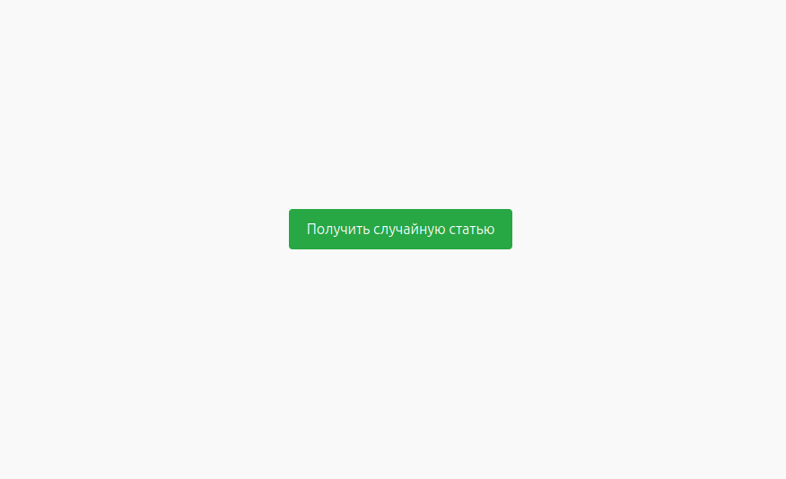
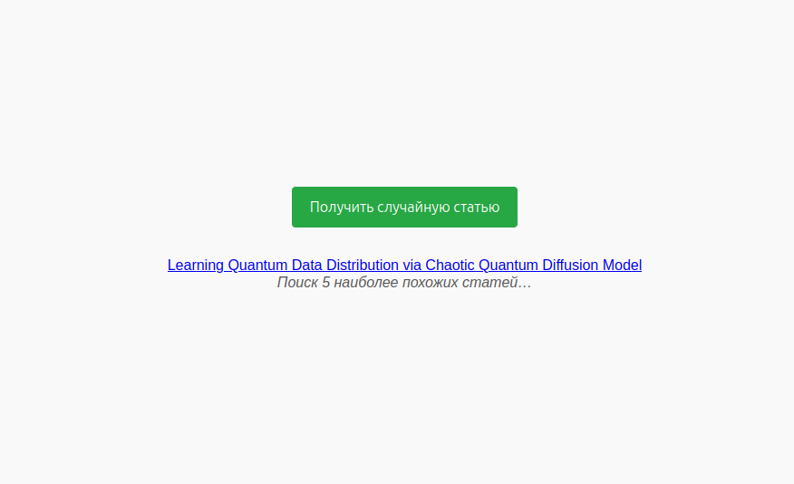
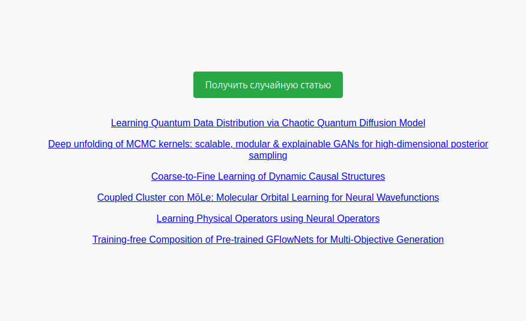

# Рекомендательная система научных статей на основе семантического сходства

В данной системе использовалась модель-трансформер "DistilBERT base model (uncased)", вычисляющая и нормализующая эмбеддинги раздела "Abstract" каждой статьи. Эмбеддинги использовались для вычисления косинусного коэффициента между выбранной пользователем статьей и каждой из остальных статей. Пользователь получает 5 статей, для которых вычисленный косинусный коэффициент был наибольшим.

## Как запустить:
```bash
git clone https://github.com/daniel-markin/Article-Recommendation-System.git && cd Article-Recommendation-System && docker compose up --build
```

Подождать несколько минут, в течение которых скачиваются данные статей, загружается модель, вычисляются эмбеддинги.
В адресной строке браузера перейти на URL: http://localhost:8080

## Результат работы программы:
### 1. При нажатии на кнопку пользователь получает случайную статью из базы данных:

### 2. Поиск 5 наиболее похожих статей:

### 3. Отображение всех найденных статей:

